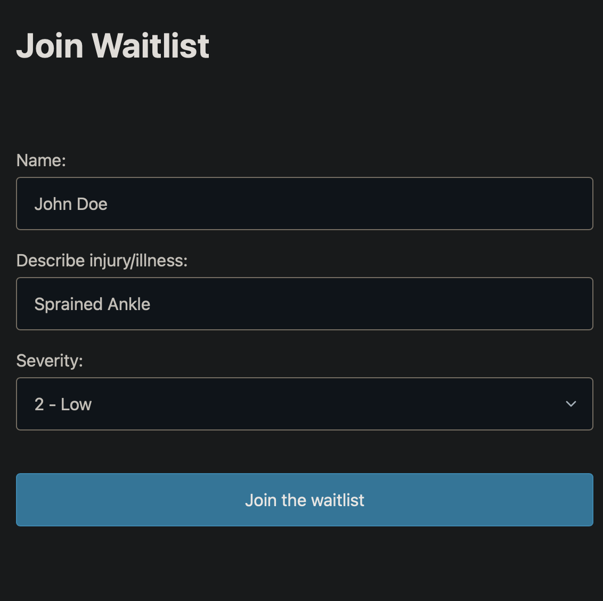
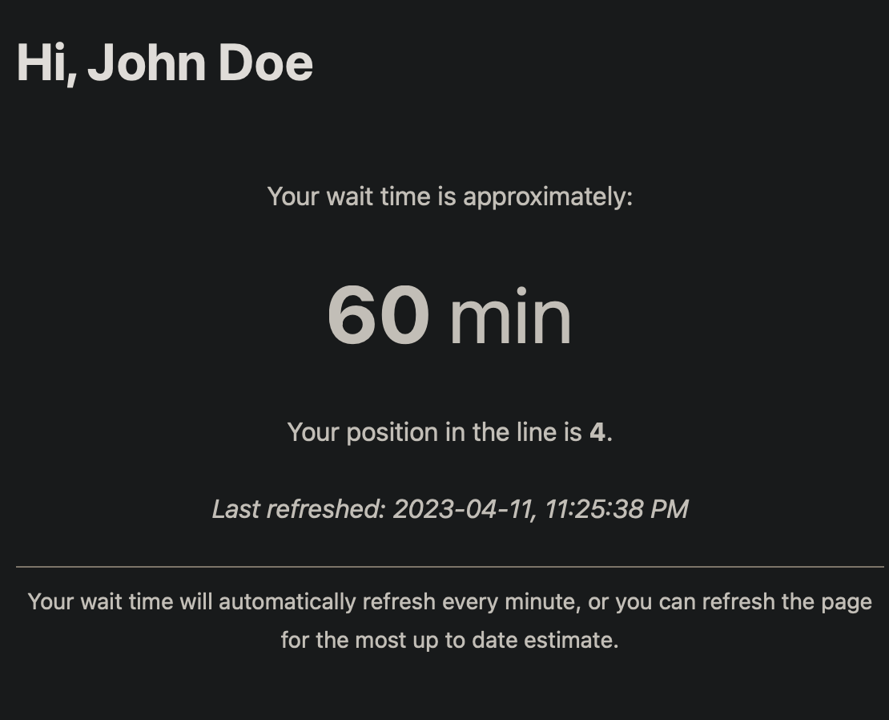
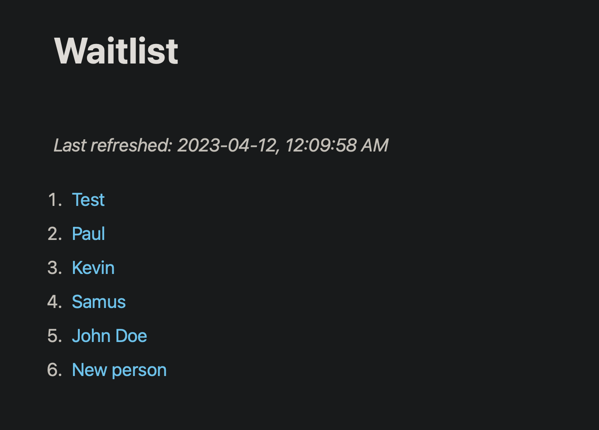
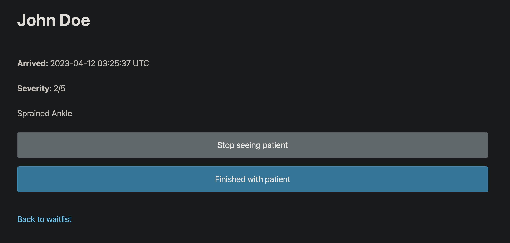

# Emergency Waitlist
>Devoir 4 pour le cours CSI3540

J'ai utilisé Python (Flask) pour le backend et SQLite pour la base de données.

[Schéma de base de données](/docs/db_schema.md)

## Installation

### Installer Python
Pour installer l'application vous devez avoir une version récent de Python. J'ai utilisé la version 3.11 pour le développement de l'application, mais il est possible que les version un peu plus anciennes fonctionnent également.

### Installer l'application
Une fois Python installé, il suffit de télécharger le code source, naviguer vers le répertoire du projet dans un terminal, et utiliser ```pip install -r requirements.txt``` pour installer les packages et les modules nécessaires pour exécuter l'application.

#### Initialiser la base de données
Ensuite, vous devez exécuter le fichier ```init_db.py``` avec la commande ```python init_db.py```, et vous devriez voir un message que la base de données a été initialisée. Ceci devrait créer un fichier ```database.db```.

#### Exécuter le serveur web
Vous pouvez enfin exécuter l'application! Vous n'avez qu'à exécuter ```python app.py``` pour lancer le serveur web de l'application. Le serveur continuera de s'exécuter jusqu'à interruption.

## Utilisation

Pour accéder l'application, ouvrez un navigateur et accédez ```localhost:4356``` (ou remplacez ```localhost``` par l'IP local de la machine où s'exécute le serveur web). Ceci vous emportera à la page client/patient.

### Client

À partir d'ici vous pourrez vous joindre à la liste d'attente en remplissant tout simplement le formulaire. Une fois dans la liste d'attente, la page se mets à jour automatiquement à chaque minute avec une estimation du temps avant de voir un docteur. L'ID du patient est stocké dans la session du navigateur, donc l'utilisateur peut retourner à la page d'accueil si il perds la page d'attente et il sera redirigé à la bonne place. Le processus complet fonctionne très bien dans le navigateur d'un téléphone intelligent.

### Administrateur

Pour accéder à la section administrateur, il faut tout simplement aller à ```localhost:4356/admin```. La liste d'attente sera affichée en ordre de priorité (selon le temps d'arrivé des patients et la gravité de leur blessure/maladie). Ici, on peut cliquer sur le nom des patients et naviguer à une page qui affiche leur information. On peut également gérer le patient ici. Lorsqu'on est avec un patient, on peut le marquer de façon que les autres administrateurs peuvent le savoir et ne pas se mettre à chercher le même patient. Une fois terminé avec un patient, on peut le marquer et il sera enlevé de la liste. La page d'attente du patient sera également mise à jour (cela peut prendre une minute) pour afficher un petit message.

## Améliorations à faire

Malgré que l'application fonctionne, il manque plusieurs choses pour que celle-ci soit complète. Voici quelques exemples d'amélioration:

1. Ajouter de la sécurité sur le pages administrateurs (pour interdire les patients d'y accéder)
2. Permettre au patient de changer ses informations et de quitter la liste d'attente (Ceci fait parti des exigences du devoir, mais j'ai oublié de le faire)
3. Ajouter plus de fonctionnalités liées à la gestion pour mieux gérer les patients


## Apparence/Images

Le framework CSS [Pico](https://picocss.com) a été utilisé pour donner une apparence moderne à l'application.

### Client

#### Joindre la liste d'attente


#### Dans la liste d'attente


### Administrateur

#### Voir la liste d'attente


#### Informations et gestion du patient
